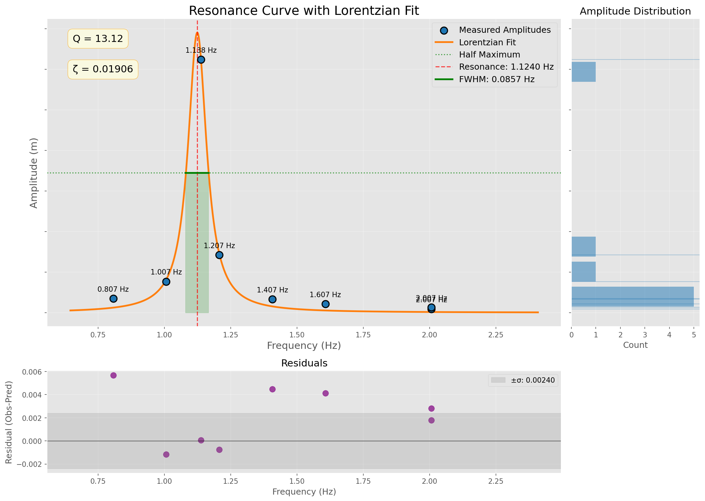

# Smorzamento: Oscillatory System Analysis



## Overview

This repository contains a collection of scripts for analyzing and visualizing data from oscillatory systems with different damping mechanisms. It focuses on both linear damping (proportional to velocity) and quadratic damping (proportional to velocity squared), as well as resonance behaviors.

## Project Structure

```
smorzamento/
├── data_raw/        # Original experimental data files
├── data_simulated/  # Generated simulation data files
├── scripts/         # Analysis and data generation scripts
├── results/         # Output from analysis
│   ├── plots/       # Generated visualizations
│   └── analysis/    # Analysis results and numerical data
└── docs/            # Documentation files
```

## Features

- **Damping Analysis**: Tools for analyzing both linear and quadratic damping in oscillatory systems
- **Resonance Analysis**: Analysis of resonance curves with Lorentzian fitting
- **Data Simulation**: Generation of synthetic data for various damping scenarios
- **Visualization**: Comprehensive plotting utilities for time series and frequency responses
- **Interactive Gallery**: Bootstrap-powered gallery for browsing visualization results

## Scripts

### Linear Damping
- `scripts/analyze_exponential_damping.py`: Analysis for systems with linear damping (exponential decay)

### Quadratic Damping
- `scripts/analyze_quadratic_damping.py`: Analysis for systems with quadratic damping (1/t decay)
- `scripts/analyze_long_quadratic_damping.py`: Analysis for long-duration samples
- `scripts/generate_multiple_quadratic_damping.py`: Simulation of various quadratic damping scenarios

### Resonance Analysis
- `scripts/analyze_resonance.py`: Basic resonance curve analysis
- `scripts/analyze_resonance_enhanced.py`: Enhanced resonance analysis with Lorentzian fitting

### Utilities
- `scripts/generate_bootstrap_gallery_with_template.py`: Creates a Bootstrap-powered visualization gallery
- `view_gallery.py`: Launches the visualization gallery in a web browser

## Key Results

### Quadratic Damping

The analysis of quadratic damping yields:
- Amplitude decay that follows A(t) = A₀/(1 + β·A₀·t) rather than exponential decay
- Damping parameter related to physical coefficient: β = (8·b·ω)/(3·π·m)
- Statistical validation through comparison with linear models

### Resonance Analysis

The resonance analysis reveals:
- Resonance Frequency (f₀): 1.124 ± 0.007 Hz
- Quality Factor (Q): 13.12
- Spring Constant (k): 7.078 N/m
- Damping Ratio (ζ): 0.0191

## Usage

To run analysis on existing data:
```bash
python scripts/analyze_quadratic_damping.py
python scripts/analyze_resonance_enhanced.py
```

To generate new simulated data:
```bash
python scripts/generate_multiple_quadratic_damping.py
```

To view the visualization gallery:
```bash
python view_gallery.py
```

## Dependencies

- NumPy
- SciPy
- Pandas
- Matplotlib
- Bootstrap (for gallery)

## License

MIT License